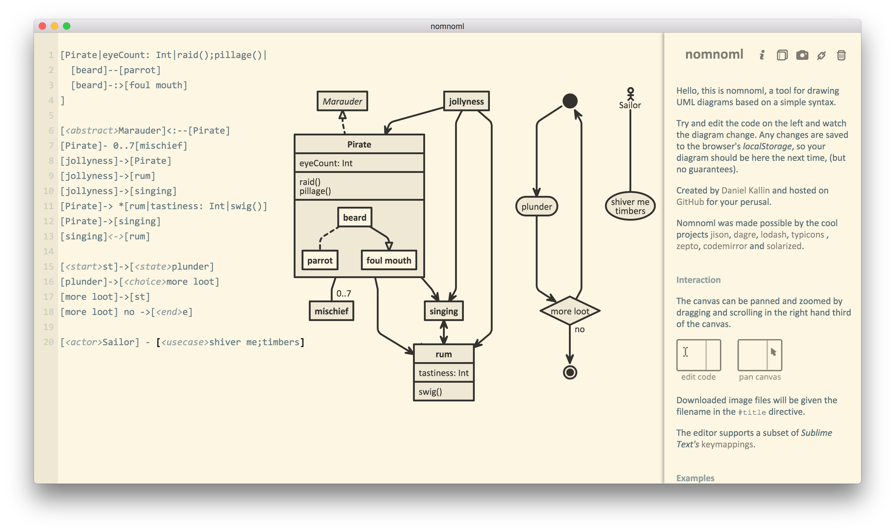
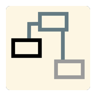

# Nomnoml for Windows

>This is a hybrid project which use [Electron](https://github.com/atom/electron) pack the JavaScript project [Nomnoml](https://github.com/skanaar/nomnoml) to a desktop application on Windows.

## A UML Class Diagram Tool

### Features

- Text-based
- Automatic Graphic Generation
- Automatic Save
- Solarized Light Color Scheme
- Sufficient Document
- Can Export Transparent Snapshot
- Re-designed new icon

### Run

Use *npm start*  to run the app
